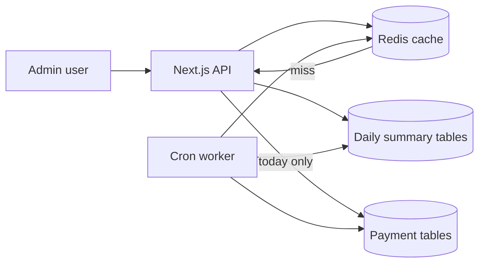

# Revenue reports — data flow (non-technical)

Two admin reports that used to scan large payment tables on every page load now use **daily summaries**, **Redis**, and a **background worker**—same idea as the home dashboard.

## Subscription Revenue Report

- **Page:** Dashboard → Subscription Revenue (default: last 7 days)
- **What you see:** Kabbik, MyBl, and Course revenue by day and payment method
- **Freshness:** Cached up to **60 minutes** in Redis (full API JSON); worker refreshes defaults every **15 minutes**; **Refresh** forces a new read (permission required)
- **Today:** Always calculated live so intraday numbers stay current
- **Past days:** Stored in `daily_subscription_revenue_stats` overnight

## Package Wise Report

- **Page:** Dashboard → Package Wise Report (default: month-to-date, Dhaka)
- **What you see:** Revenue total per subscription package
- **Freshness:** Redis `report:pkg-wise:v1:{start}:{end}` — 30 min if range includes today, else 24 h
- **Past days:** `daily_package_revenue_stats` (built at **00:10** with other rollups)
- **Today:** Live per-gateway day query only for today’s slice
- **Legacy SQL:** `PACKAGE_WISE_LEGACY=1` forces old UNION range query

## Payment Gateway Wise Report

- **Page:** Dashboard → Payment Gateway Wise (default: today only)
- **What you see:** One row per gateway with amount and new/existing subscribers
- **Freshness:** Same cache + Refresh pattern
- **Past days:** Stored in `daily_pgw_revenue_stats`

## Background jobs (Asia/Dhaka)

| When | What |
|------|------|
| Worker startup | Warm home + default revenue reports into Redis |
| 00:10 daily | Payment + subscription/PGW + **package-wise** rollups for yesterday, then warm secondary report caches (incl. MTD package-wise) |
| Every 15 min | Refresh home snapshot in Redis (logical freshness 3600s; key retention 86400s) |
| Every 15 min | Refresh default subscription (7 days) + PGW (today) in Redis (same TTL model) |

Redis stores **assembled API responses** (`dash:home`, `revenue:sub:v1:…`, `revenue:pgw:v1:…`), not raw rollup rows. Run the worker with `pnpm run worker` on the server (separate from the website process). Without the worker, first visitors pay the full MySQL cost until something fills the cache.

## Diagram

## Verification checklist

- [ ] Default date ranges return the same shapes as before (subscription object, PGW array in `data`)
- [ ] Second request faster when Redis enabled (`CACHE_ENABLED=true`)
- [ ] Site still works if Redis down (fail-open to MySQL)
- [ ] Yesterday rollup matches manual single-day recompute
- [ ] Refresh without permission → 401
- [ ] Only one worker run at a time per job (Redis cron locks)
